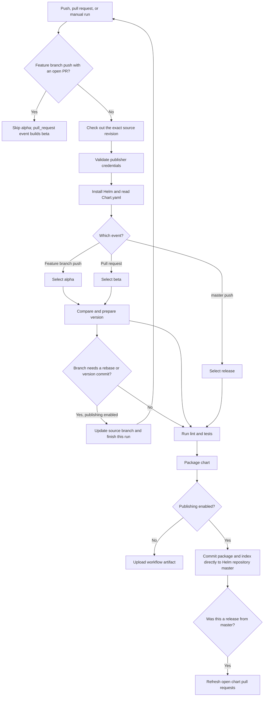

# GitHub Actions Helm publishing pipeline

This guide explains how the FFC Helm library is tested, versioned, packaged and
published. It is written for developers who are new to GitHub Actions as well
as maintainers who need to diagnose or change the pipeline.

The workflow is defined in
[`.github/workflows/publish.yml`](.github/workflows/publish.yml).

## What the pipeline produces

The source chart keeps a normal three-part version in
[`ffc-helm-library/Chart.yaml`](ffc-helm-library/Chart.yaml), for example
`5.2.2`. The event that starts the workflow decides which package is produced:

| Event | Channel | Example package |
| --- | --- | --- |
| Push to a feature branch | Alpha | `ffc-helm-library-5.2.2-alpha.123.tgz` |
| Pull request targeting `master` | Beta | `ffc-helm-library-5.2.2-beta.124.tgz` |
| Push/merge to `master` | Release | `ffc-helm-library-5.2.2.tgz` |

`123` and `124` are GitHub Actions run numbers. They make every alpha and beta
build unique. A beta represents the version currently proposed by a pull
request, and a release is the final chart produced from `master`.

When publishing is enabled, the package and regenerated `index.yaml` are
committed directly to the `master` branch of
[`DEFRA/ffc-helm-repository`](https://github.com/DEFRA/ffc-helm-repository).
The workflow does not create a pull request in that repository.

## GitHub Actions concepts used here

A few terms make the workflow easier to read:

- **Workflow**: the complete automation described by `publish.yml`.
- **Event**: something that starts the workflow, such as a push or pull request.
- **Job**: a group of steps executed on a fresh runner. This workflow has a
  decision job, a packaging job and a job that refreshes open pull requests
  after a release.
- **Runner**: the temporary Ubuntu machine on which a job runs.
- **Step**: one action or shell script within a job.
- **Context**: GitHub-provided data such as `${{ github.ref_name }}` or
  `${{ github.run_number }}`.
- **Output**: a value calculated by one step and read by a later step. For
  example, the version step writes a `version` output.
- **Secret**: an encrypted repository setting, used here for the publisher PAT.
- **Variable**: a non-secret repository setting, used here to enable publishing.
- **Artifact**: a file retained with a workflow run. In dry-run mode, the chart
  package is uploaded as an artifact instead of being published.

## End-to-end flow



The source-branch update is intentionally a separate pass. After the bot pushes
a rebase or version bump, GitHub starts a new workflow for the new commit. This
prevents the pipeline from publishing a package from a commit that is not the
current commit on the branch.

## 1. Workflow triggers

The `on:` section defines when the workflow starts.

### Feature branch push

A push to a branch such as `pl-1421` starts an alpha build when it changes one
of these paths:

- `ffc-helm-library/**`
- `tests/**`
- `scripts/**`
- `.github/workflows/publish.yml`

Changes only to files such as `README.md` or this guide do not automatically
start a branch-push workflow because they are outside that path filter.

### Pull request

A pull request targeting `master` always starts the required workflow check.
The decision script inspects its changed files. A PR that changes the chart,
tests, scripts or this workflow gets a beta build; a documentation-only PR gets
a successful no-op check, so branch protection does not leave it pending.
Opening the PR, pushing another commit, or synchronising it with `master` can
produce a new PR run.

A push to a branch that already has an open PR can create both a `push` event
and a `pull_request` event. The **Decide whether to build** job queries GitHub
for an open PR from that branch targeting `master`. It skips the push event's
alpha job, while the pull-request event continues and creates one beta package.
If the PR is closed without being merged, a later branch push can produce alpha
packages again.

### Merge queue

GitHub's merge queue starts a `merge_group` event for its synthetic merge
commit. The workflow checks out that commit and runs lint and tests, but it does
not change a branch, package a chart or publish anything. This supplies the
required check safely before the queue merges the PR.

### Push or merge to `master`

Merging a pull request creates a push on `master`. That run packages the exact
version in `Chart.yaml` without a pre-release suffix.

The workflow never merges the pull request. Approval and merging remain manual,
and branch protection should require the GitHub Actions check to pass first.

### Manual run

The workflow can also be started from **Actions → Package and publish Helm
library → Run workflow**. Its `channel` input has these choices:

- `auto`: choose alpha, beta or release from the event/ref.
- `alpha`: force an alpha package.
- `beta`: force a beta package with the current run number.
- `release`: force an unsuffixed package.

Normally use `auto`. A manual override changes the package name; the workflow
rejects the `release` channel unless the selected ref is `master`.

## 2. Permissions and concurrency

The workflow declares read access to repository contents and pull requests for
the built-in `GITHUB_TOKEN`. Cross-repository writes use the separately managed
publisher token described later.

All runs use the same concurrency group, `helm-library-publish`, with
`cancel-in-progress: false`. This serialises publication so two runs do not try
to update the Helm repository at exactly the same time. New runs wait instead
of cancelling the active run.

## 3. Checkout

`actions/checkout@v4` downloads the source with full Git history:

```yaml
with:
  fetch-depth: 0
  persist-credentials: false
  ref: ${{ github.event.pull_request.head.sha || github.sha }}
```

Full history is needed for ancestry checks and rebasing. For a PR, the workflow
checks out the PR's head commit, not GitHub's synthetic merge commit. This is
important because the workflow may need to update the real source branch.
Checkout does not persist a Git credential in the working tree; write steps
receive their credential only when needed.

## 4. Publisher credential check

The workflow reads the repository secret `FFC_HELM_REPOSITORY_TOKEN` into
`GH_TOKEN` and uses the GitHub CLI to:

1. Identify the account that owns the token.
2. Confirm write access to `DEFRA/ffc-helm-library`.
3. Confirm write access to `DEFRA/ffc-helm-repository`.

This check runs for chart builds before testing even when
`HELM_PUBLISH_ENABLED` is not `true`. It is skipped for documentation-only PRs
and merge-queue validation. GitHub masks secret values in logs; the workflow
prints only the authenticated account name and permission result.

The token must be stored at:

**ffc-helm-library → Settings → Secrets and variables → Actions → Secrets →
New repository secret**

Use the exact name `FFC_HELM_REPOSITORY_TOKEN`. Do not put the token in YAML,
source code, a commit, an issue, or a pull-request comment.

The token needs enough access to push branch changes in `ffc-helm-library`,
publish to `ffc-helm-repository`, inspect pull requests, and dispatch workflow
runs. A normal repository `GITHUB_TOKEN` cannot write to a different repository.

## 5. Helm setup and source-version validation

`azure/setup-helm@v4` installs Helm on the runner. The next step reads the chart
version using [`scripts/chart-version.py`](scripts/chart-version.py).

The source version must be exactly three non-negative integers:

```text
MAJOR.MINOR.PATCH
```

Examples:

- Valid: `5.2.2`
- Invalid: `5.2`
- Invalid: `v5.2.2`
- Invalid: `5.2.2-beta`

Alpha and beta suffixes are added only while packaging. They must not be saved
in `Chart.yaml`.

## 6. Channel selection

With the default `auto` setting, shell logic chooses:

```text
pull_request event  -> beta
merge_group event   -> validation only
master ref          -> release
anything else       -> alpha
```

The result is stored as the `channel` output and used later by the package step.

## 7. Version calculation on branches and PRs

Version preparation runs on every ref except `master`. It reads two versions:

- **Previous version**: `Chart.yaml` from the target branch, normally
  `origin/master`.
- **Current version**: `Chart.yaml` from the feature branch or PR.

[`scripts/resolve-chart-version.py`](scripts/resolve-chart-version.py) applies
these rules:

| `master` version | Branch version | Resolved version | Reason |
| --- | --- | --- | --- |
| `5.2.1` | `5.2.1` | `5.2.2` | Unchanged, so increment patch |
| `5.2.1` | `5.2.0` | `5.2.2` | Patch is not ahead, so increment patch |
| `5.2.1` | `5.2.4` | `5.2.4` | Developer supplied a higher patch |
| `5.2.1` | `5.3.8` | `5.3.0` | Developer changed minor; reset patch |
| `5.2.1` | `6.0.7` | `6.0.0` | Developer changed major; reset patch |
| `5.2.1` | `5.1.9` | Error | Major/minor cannot move backwards |

For the current `5.2` release line, developers should leave the major/minor as
`5.2` unless a major or minor release has been deliberately agreed.

### Rebase before calculation

The workflow first tests whether the source branch contains the latest target
branch commit. If it is behind, it attempts:

```bash
git rebase origin/master
```

If the rebase conflicts, it is aborted and the workflow fails with instructions
to resolve and push the rebase manually. If it succeeds, the version is read
again and recalculated against the new `master`.

### Automatic branch update

When publishing is enabled and either the rebase or version changed, the
workflow:

1. Updates `Chart.yaml` in the runner.
2. Creates a `Bump chart version to ...` commit if required.
3. Pushes the source branch with `--force-with-lease`.
4. Marks the current run as changed, so testing and publishing steps are skipped.

`--force-with-lease` is used because a rebase rewrites history, but it refuses
to overwrite a branch that moved unexpectedly on GitHub. The resulting push
starts the clean build that tests and packages the updated commit.

When publishing is disabled, the version is changed only in the temporary
runner checkout. It is tested and packaged as a downloadable artifact but is
not pushed to the developer's branch.

## 8. What happens when two PRs propose the same patch

Suppose `master` is `5.2.1`, and PR A and PR B both initially resolve to
`5.2.2`:

1. Both PRs can initially build unique packages such as `5.2.2-beta.120` and
   `5.2.2-beta.121`.
2. PR A is approved and manually merged.
3. The `master` run publishes the full `5.2.2` release.
4. The refresh job starts PR B again against the new `master`.
5. PR B is rebased where possible and resolves to `5.2.3`.
6. The bot updates PR B; its next beta is, for example, `5.2.3-beta.125`.
7. Required up-to-date checks prevent PR B from merging with its stale result.

This relies on `master` branch protection requiring the **Package and publish
chart** check and requiring branches to be up to date before merging (or using
a merge queue).

## 9. Tests run before packaging

Tests run only after any required source-branch update has completed and the
new workflow run starts.

### Helm lint

```bash
helm lint ffc-helm-library
```

This checks the library chart's metadata and Helm structure.

### Consumer rendering test

[`tests/test-chart.sh`](tests/test-chart.sh) uses the small application chart in
[`tests/consumer`](tests/consumer) as a real consumer of the library. It:

1. Confirms the source version has three numeric parts.
2. Lints the library chart.
3. Resolves the consumer's local `file://` dependency.
4. Lints the consumer chart.
5. Renders its Kubernetes manifests with `helm template`.
6. Checks representative Deployment, Service, ConfigMap, Secret, autoscaling,
   ingress, identity and security-context output.
7. Confirms rendering fails with the expected message when a required image
   value is missing.

This catches template integration problems that a library-only lint may miss.

### Versioning and package-name test

[`tests/test-versioning.sh`](tests/test-versioning.sh) tests the version resolver
with normal increments, manual patch changes, major/minor changes, downgrades and
invalid versions. It also asks Helm to build all three expected package forms
and checks that the `.tgz` files exist.

[`tests/test-pipeline-scripts.sh`](tests/test-pipeline-scripts.sh) exercises the
extracted channel, event-decision, metadata update, validation, packaging and
index lookup scripts. It also tests token rejection, branch updates, duplicate
publication, new publication and PR refresh behavior using a mocked GitHub CLI
and temporary local Git repositories. It never contacts or changes a real
repository.

## 10. Packaging

The package step combines the resolved source version with the selected channel:

```text
alpha   -> MAJOR.MINOR.PATCH-alpha.GITHUB_RUN_NUMBER
beta    -> MAJOR.MINOR.PATCH-beta.GITHUB_RUN_NUMBER
release -> MAJOR.MINOR.PATCH
```

The dot makes the run number a separate numeric SemVer identifier. Numeric
identifiers sort correctly when a run changes from `99` to `100`; a hyphenated
suffix such as `beta-100` would be treated as one lexical identifier.

For alpha and beta, `helm package --version` changes only the metadata inside
the generated package. It does not add a suffix to the committed `Chart.yaml`.
The package is first created in the runner's temporary directory.

## 11. Publishing to the Helm repository

Publishing happens only when the repository Actions variable
`HELM_PUBLISH_ENABLED` is exactly `true`.

Create or inspect it at:

**ffc-helm-library → Settings → Secrets and variables → Actions → Variables**

When enabled, the publishing step:

1. Authenticates Git using `FFC_HELM_REPOSITORY_TOKEN`.
2. Clones `DEFRA/ffc-helm-repository` at `master` into a temporary directory.
3. Copies the new `.tgz` package into the repository.
4. Runs `helm repo index --merge` so existing index entries are preserved.
5. Stages the package and new `index.yaml`.
6. Commits `Add new version <version>`.
7. Pushes directly to `ffc-helm-repository/master`.

Before rebuilding the index, the publisher checks whether the exact chart name
and version already exist in `index.yaml`. An existing version is treated as an
immutable successful publication rather than generating a timestamp-only index
commit. If another run updates the Helm repository during publication, the step
fetches the latest `master`, checks again, rebuilds the index and retries, up to
three times.

The publisher account must be allowed to bypass the protected `master` branch
in `ffc-helm-repository`, because this direct push deliberately matches the
retired Jenkins behaviour.

### Dry-run mode

If `HELM_PUBLISH_ENABLED` is not `true`, the package is uploaded to the workflow
run using `actions/upload-artifact@v4`. It can be downloaded from the run's
**Artifacts** section. Nothing is pushed to `ffc-helm-repository`.

## 12. Refreshing open PRs after a release

The `refresh-open-pull-requests` job runs only after a successful published push
to `master`. It finds open same-repository PRs targeting `master`, checks which
ones change `ffc-helm-library/`, and automatically dispatches their workflow
with the beta channel through the GitHub API. No developer needs to press the
**Run workflow** button.

This is what makes an older open PR recalculate after another PR consumes its
expected patch version. Fork-based PRs are excluded because the publisher token
must not push into an untrusted fork.

## 13. Required repository settings

The production configuration is:

| Type | Name | Purpose |
| --- | --- | --- |
| Actions secret | `FFC_HELM_REPOSITORY_TOKEN` | Authenticates branch updates, cross-repository publication and PR refreshes |
| Actions variable | `HELM_PUBLISH_ENABLED=true` | Enables Git pushes instead of artifact-only dry runs |
| Branch protection | Required `Package and publish chart` check | Stops merge when the pipeline fails |
| Branch protection | Require up-to-date branch or merge queue | Makes stale PRs recalculate before merge |
| Helm repository rule | Publisher bypass for `master` | Allows direct package/index publication |

Secrets are not normally made available to workflows triggered from forks.
Consequently, this publishing workflow is designed for branches within the
DEFRA repository; a fork PR will fail the credential check unless the workflow
is changed to support an explicitly safe, read-only mode.

## 14. Running the tests locally

Install Helm and Python 3, then run from the repository root:

```bash
helm lint ffc-helm-library
bash tests/test-chart.sh
bash tests/test-pipeline.sh
```

The scripts create temporary files and remove the generated consumer dependency
files when they finish.

To inspect only the version decision:

```bash
python3 scripts/resolve-chart-version.py 5.2.1 5.2.1
```

This prints `5.2.2`.

## 15. Reading a workflow run

Open the repository's **Actions** tab, choose **Package and publish Helm
library**, and select the run. Read it in this order:

1. Check the event and branch shown at the top.
2. Open **Package and publish chart**.
3. Find **Select package channel** to confirm alpha, beta or release.
4. Read **Prepare chart version** for the previous, current and resolved branch
   state, especially when the bot pushed another commit.
5. Check all three test steps.
6. Open **Package chart** to see the final package version.
7. Open **Publish chart and update index**, or **Upload dry-run chart package**,
   depending on the repository variable.
8. For a `master` release, also inspect **Refresh open chart pull requests**.

Common outcomes:

- **A branch workflow did not start**: no configured path changed or Actions
  are disabled. PR checks targeting `master` run even for documentation changes.
- **A run finishes without test/package steps**: the bot updated the source
  branch; inspect the new run created by that push.
- **Credential check fails**: the secret is absent, expired, or lacks access to
  one of the two repositories.
- **Rebase fails**: update the branch from `master`, resolve conflicts locally,
  and push it again.
- **Direct publication fails after three attempts**: confirm the publisher's
  write access and protected-branch bypass in `ffc-helm-repository`.
- **A PR cannot merge after another release**: wait for or manually rerun its
  beta workflow so it can rebase and select the next patch.

## 16. Safe ways to change the pipeline

When editing the workflow or its scripts:

1. Make the change on a feature branch.
2. Add or update a case in `tests/test-versioning.sh` for version logic changes.
3. Add or update the consumer fixture for chart-template changes.
4. Run all local tests.
5. Push the branch and inspect its alpha run.
6. Open a PR and inspect the separate beta run.
7. Do not manually merge until the required beta check is green and current
   with `master`.

Keep package naming, source-version rules and repository publication logic in
sync. A version may be used in `Chart.yaml`, the resolver, the package filename,
the package metadata and `index.yaml`; tests should cover all affected places.

## 17. Script map

The YAML file only orchestrates jobs and passes GitHub context into these
scripts:

| Script | Responsibility |
| --- | --- |
| `scripts/decide-build.sh` | Detect relevant PR changes and suppress alpha when an open PR will build beta |
| `scripts/verify-publisher-token.sh` | Validate publisher identity and repository access |
| `scripts/validate-chart-version.sh` | Read and validate the source SemVer |
| `scripts/select-package-channel.sh` | Select alpha, beta, release or merge-queue validation |
| `scripts/prepare-chart-version.sh` | Rebase, resolve the next version, commit and update the source branch |
| `scripts/set-chart-version.py` | Safely replace the `Chart.yaml` version field |
| `scripts/package-chart.sh` | Build the correctly named `.tgz` and expose step outputs |
| `scripts/index-has-chart-version.py` | Detect an existing immutable chart version in `index.yaml` |
| `scripts/publish-chart.sh` | Update and push the Helm repository with retry handling |
| `scripts/refresh-open-pull-requests.sh` | Dispatch recalculation for other open chart PRs after a release |

This separation keeps GitHub-specific orchestration readable and makes the
implementation testable from a developer machine.
